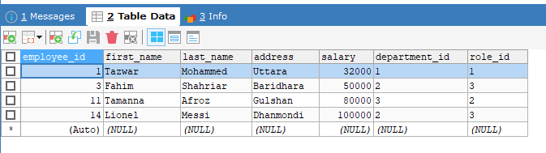
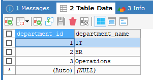
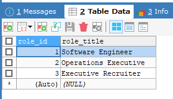
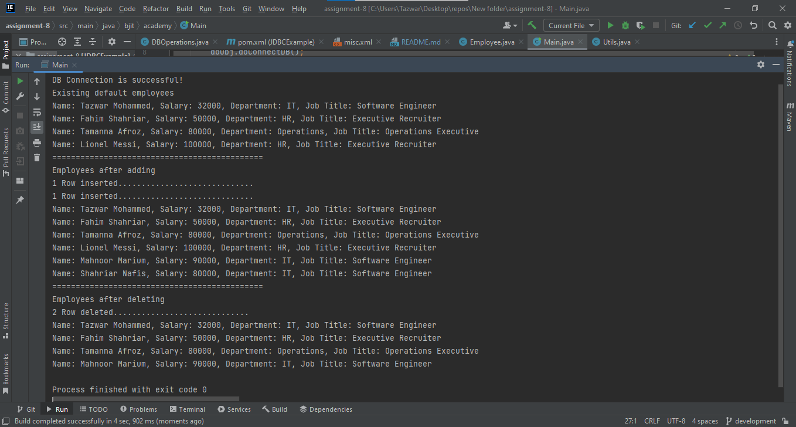
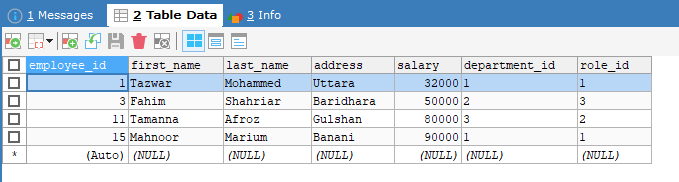

# JDBC Implementaion

## There are three main operations:
1. Select all employee records with details by joining tables
2. Add a custom employee
3. Delete employee (only with address = 'Dhanmondi')

## Step-by-step workflow with screenshots

### Step 1: Three tables

`employee` table

`department` table

`employee_role` table

### Step 2: Run code and output

### Step 3: Changes are reflected onto the `employee `table

